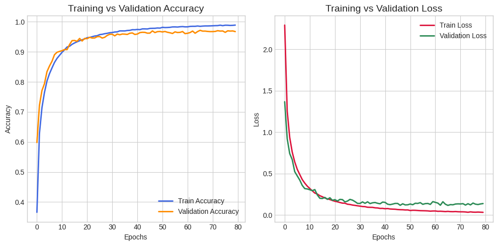
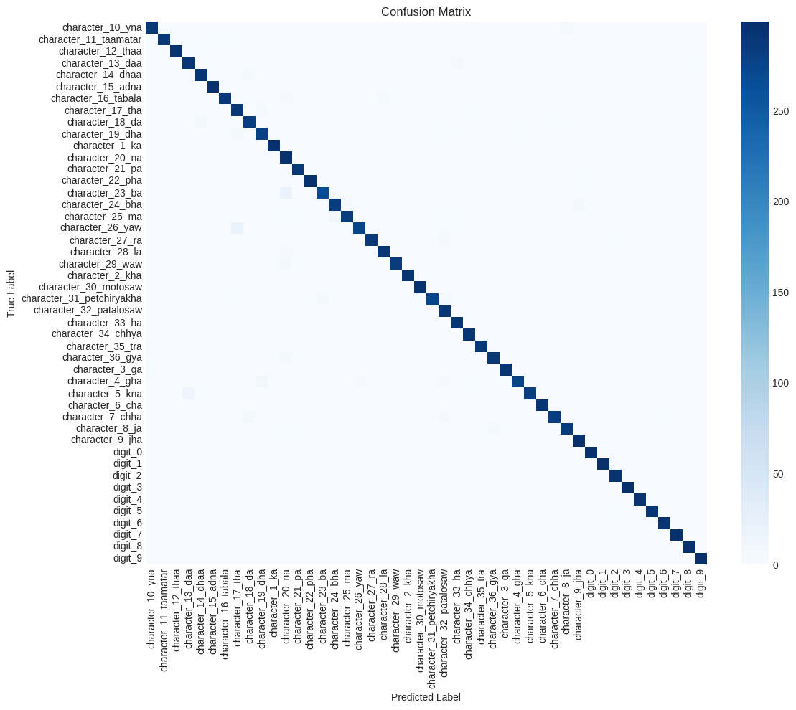
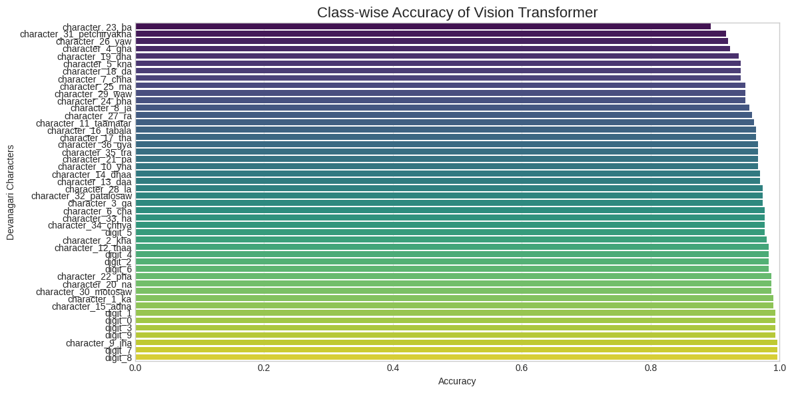
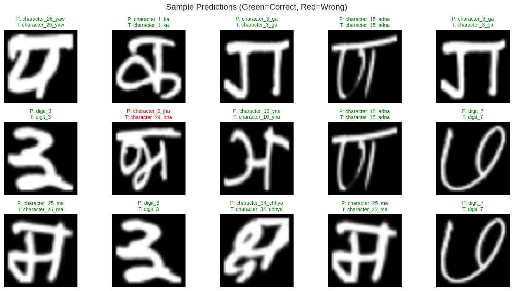
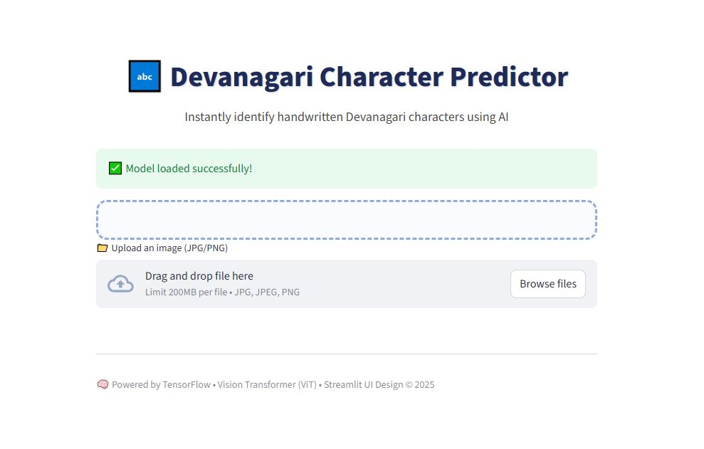
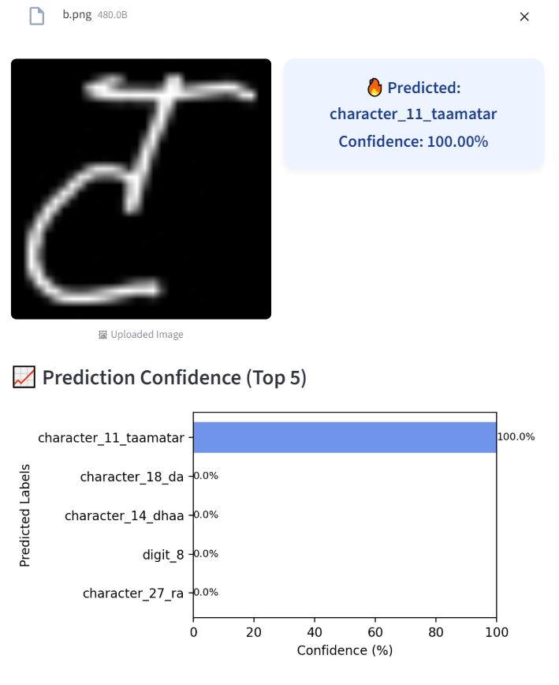

# 🕉️ Devnagari Symbol Detection using Vision Transformer (ViT)

[]()
[]()
[](https://colab.research.google.com/github/Pranta-Chy/devnagari-symbol-detect/blob/main/notebooks/devnagari_scriptpred_vit_final.ipynb)
[]()
[](https://devnagari-character-predictor-xwy93napvjb8m6b8wdlcsz.streamlit.app/)

---

### 🧠 Project Overview
This project implements a **Vision Transformer (ViT)** model to recognize **Devanagari script symbols** from handwritten characters.  
It is built entirely using **TensorFlow/Keras**, achieving **96.7% accuracy** across **46 classes**.  

---

## 🚀 Live Demo
🎯 **Try it instantly!**  
You can upload an image and get real-time symbol predictions directly on the web:

👉 **[Open Streamlit App](https://devnagari-character-predictor-xwy93napvjb8m6b8wdlcsz.streamlit.app/)**

> No setup needed — just open the link, upload your handwritten Devanagari character image, and view the prediction result instantly.

---

## 📂 Repository Structure
devnagari-symbol-detect/
├─ model/
│ └─ vit_devanagari_final_.h5 # Final trained ViT model
├─ notebooks/
│ └─ devnagari_scriptpred_vit_final.ipynb
├─ slides/
│ └─ presentation.pdf
├─ data/ # (empty, dataset downloaded externally)
├─ requirements.txt
├─ README.md
└─ LICENSE


---

## 📊 Model Details

| Property | Value |
|-----------|-------|
| **Architecture** | Vision Transformer (custom-built from scratch) |
| **Framework** | TensorFlow / Keras |
| **Dataset** | [UCI Devanagari Handwritten Character Dataset](https://archive.ics.uci.edu/dataset/389/devanagari+handwritten+character+dataset) |
| **Classes** | 46 |
| **Input Size** | 64×64 grayscale images |
| **Accuracy** | 96.7% |
| **Optimizer** | Adam |
| **Loss Function** | Sparse Categorical Crossentropy |

---

## 📥 Dataset & Model
**Dataset:**  
Download from the [UCI Repository](https://archive.ics.uci.edu/dataset/389/devanagari+handwritten+character+dataset)  
After downloading, extract it to the `data/` folder.

**Model:**  
The trained model (`vit_devanagari_final_.h5`) is included under the `model/` directory.

---

## ⚙️ Setup & Installation (Optional - For Local Use)
If you’d like to run or train locally:

```bash
# Clone the repository
git clone https://github.com/Pranta-Chy/devnagari-symbol-detect.git
cd devnagari-symbol-detect

# (Optional) create virtual environment
python -m venv venv
source venv/bin/activate       # Windows: venv\Scripts\activate

# Install dependencies
pip install -r requirements.txt


Then open the notebook:
👉 notebooks/devnagari_scriptpred_vit_final.ipynb
or in Colab using the badge above.


## 📈 Example Outputs
**Accuracy & Loss Curve:**


**Confusion Matrix:**


**Accuracy by Class:**


**Sample Prediction:**


**Live App Preview:**




(You can add your own screenshots or examples in the assets/ folder and update this table.)

📦 Requirements
tensorflow==2.12.0
numpy
pandas
matplotlib
scikit-learn
opencv-python
tqdm
einops
transformers
streamlit

🧾 Citation

If you use this work, please cite:

Pranta Chowdhury, "Devnagari Symbol Detection using ViT", GitHub, 2025.
https://github.com/Pranta-Chy/devnagari-symbol-detect

🪪 License

This project is licensed under the MIT License
.

🌟 Acknowledgements

Dataset: UCI Machine Learning Repository

Model Architecture: Vision Transformer (ViT)

Frameworks: TensorFlow, NumPy, Matplotlib, Streamlit

⭐ If you found this project helpful, please star the repository!


